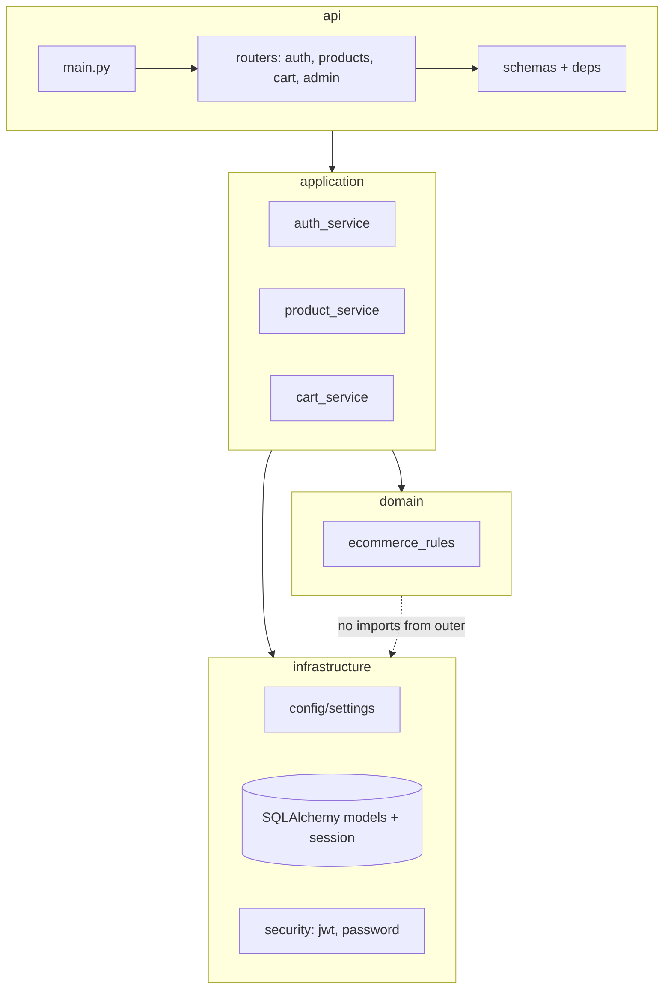
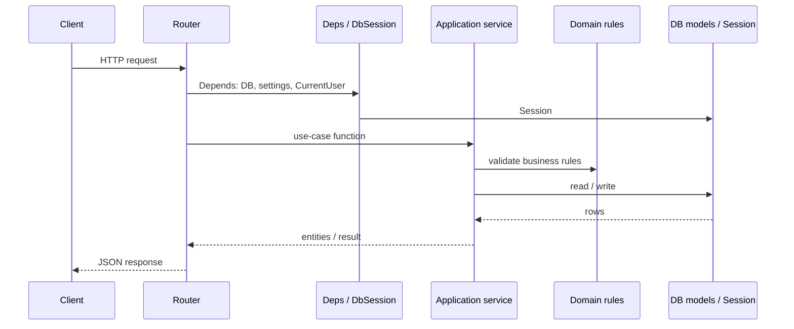
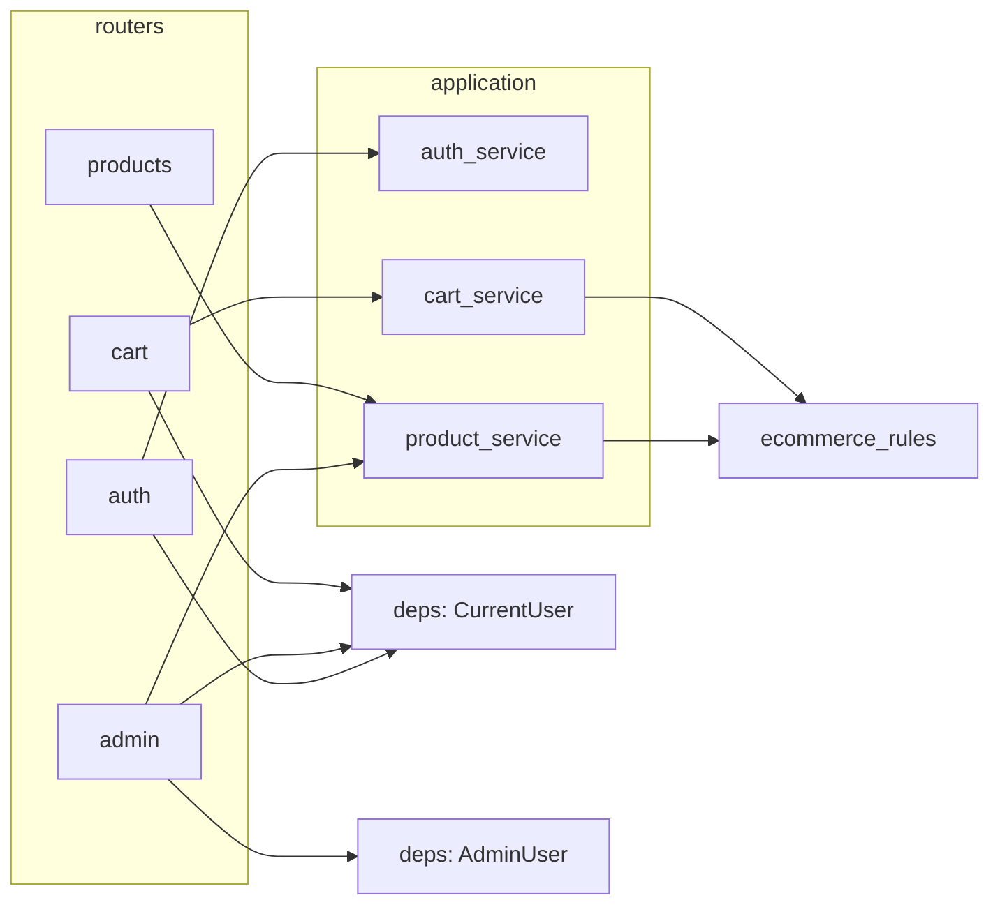
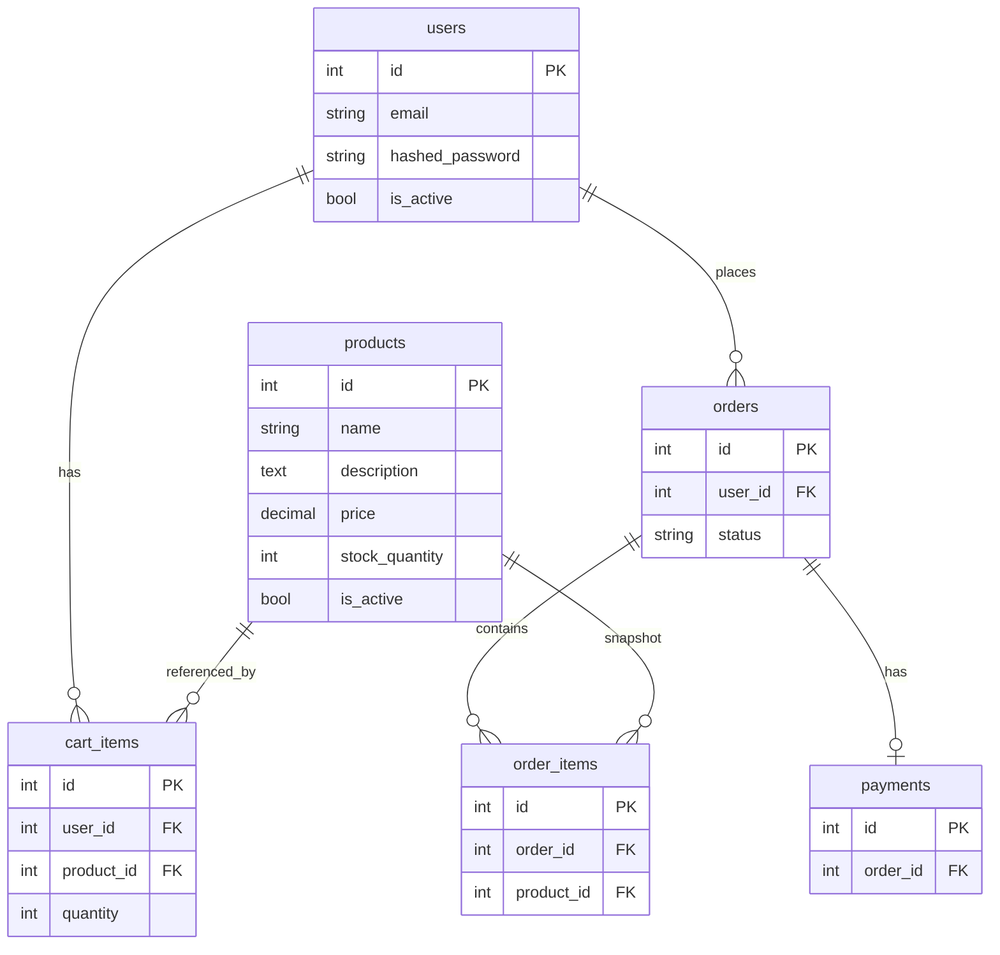
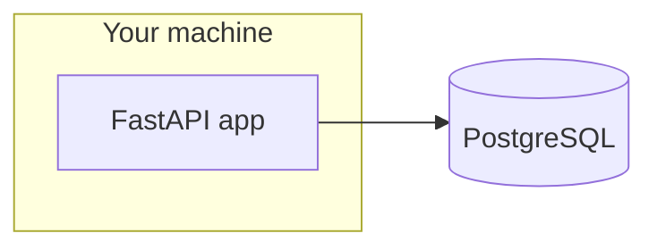

# Project diagrams — E-Commerce API

Visual overview of the **api-comerce-in** backend (onion architecture). Diagrams use [Mermaid](https://mermaid.js.org/); they render in GitHub, GitLab, many IDEs, and some Markdown viewers.

---

## 1. Onion layers (dependency direction)

Outer layers depend inward; **domain** has no framework imports.



---

## 2. Request path (typical HTTP call)



---https://youtu.be/vPzBiQc44i4?si=mVBmh1lJRcYpVyIo

## 3. API surface (`/api/v1`)

```mermaid
flowchart LR
  subgraph v1 [/api/v1]
    auth[/auth — signup, login, me/]
    products[/products — list, get/]
    cart[/cart — CRUD lines/]
    admin[/admin — products CRUD, health/]
  end

  Client((Client)) --> v1
```

---

## 4. Module dependencies (who calls whom)



---

## 5. Data model (tables)



Field names are illustrative; see `src/infrastructure/db/models/` for exact columns.

---

## 6. Repository layout (folders)

```text
src/
  api/                    # FastAPI entry, routers, schemas, HTTP deps
    main.py
    dependencies.py       # DbSession, SettingsDep
    v1/
      router.py
      routers/            # auth, products, cart, admin
      deps/               # CurrentUser, AdminUser
      schemas/
  application/            # Use cases (services)
    auth_service.py
    product_service.py
    cart_service.py
  domain/                 # Pure rules (no FastAPI / SQLAlchemy)
    ecommerce_rules.py
  infrastructure/         # DB, settings, JWT, passwords
    config/
    db/
    security/
```

---

## 7. External systems (local dev)



Future chapters (Stripe, etc.) add another box **Stripe** with webhooks back to the API.
